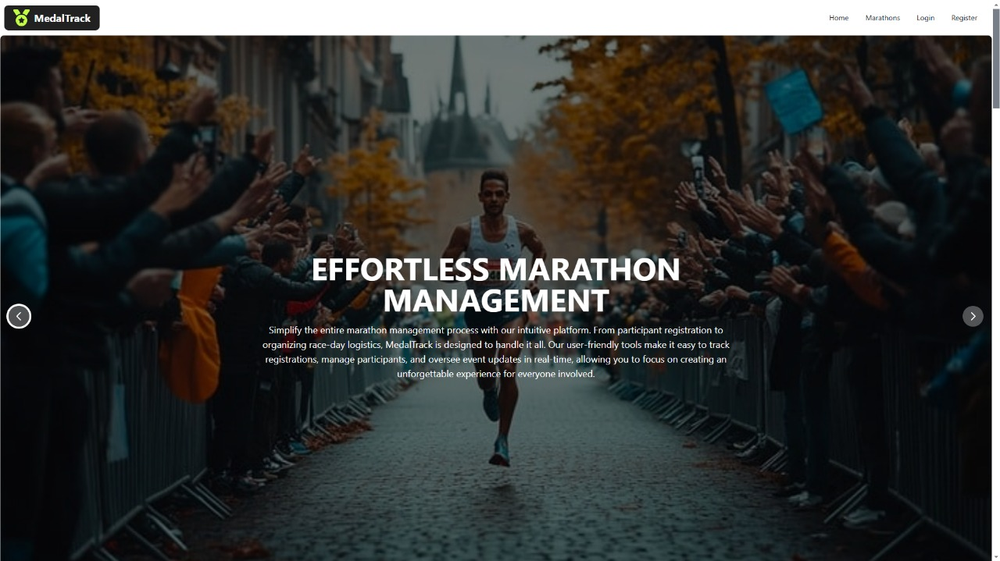

# 🏅 MedalTrack – Marathon Management Platform  

A modern web application that helps marathon enthusiasts discover, manage, and track their favorite running events with an intuitive and seamless user experience.  

## 🚀 Technologies Used  

- **React** – Component-based UI framework  
- **Tailwind CSS** – Modern styling  
- **DaisyUI** – Pre-designed UI components  
- **Flowbite** – Enhanced UI elements  
- **React Router** – Seamless navigation  
- **Axios** – Fetching and managing marathon data  
- **Firebase** – Authentication, database, and hosting  

## Screenshot
<div align="center">
  
</div>
## ✨ Features  

- **Dynamic Marathon Listings** – Browse and filter marathons worldwide  
- **Responsive Design** – Optimized UI for all devices  
- **Interactive Components** – Pre-designed elements with Flowbite  
- **Smooth Navigation** – Fast routing using React Router  
- **Real-Time Data** – Fetch marathon details with Axios  
- **Custom Dashboards** – Track registrations and progress  
- **Firebase Integration** – Secure authentication and data storage  

## 📦 Dependencies  

The project relies on the following dependencies:  

```sh
npm install react-router-dom axios daisyui flowbite firebase
```

## 🔑 Environment Variables  

This project requires Firebase configuration. Create a `.env` file in the root directory and add the following variables:  

```
VITE_apiKey="your-firebase-api-key"
VITE_authDomain="your-firebase-auth-domain"
VITE_projectId="your-firebase-project-id"
VITE_storageBucket="your-firebase-storage-bucket"
VITE_messagingSenderId="your-firebase-messaging-sender-id"
VITE_appId="your-firebase-app-id"
VITE_measurementId="your-firebase-measurement-id"
```

Replace the values with your **own Firebase credentials** from the [Firebase Console](https://console.firebase.google.com/).  

## 🛠 How to Run the Project Locally  

1. Clone the repository:  
   ```sh
   git clone https://github.com/yourusername/medaltrack.git  
   cd medaltrack  
   ```
2. Install dependencies:  
   ```sh
   npm install  
   ```
3. Add your **Firebase credentials** to the `.env` file.  
4. Start the development server:  
   ```sh
   npm run dev  
   ```

## 🌍 Live Demo  

Check out the live version: [MedalTrack – Live](https://medal-track.web.app/)  

## 📖 Additional Resources  

- [React Documentation](https://react.dev/)  
- [Tailwind CSS Docs](https://tailwindcss.com/docs)  
- [DaisyUI Components](https://daisyui.com/)  
- [Flowbite UI](https://flowbite.com/)  
- [Firebase Docs](https://firebase.google.com/docs)  
